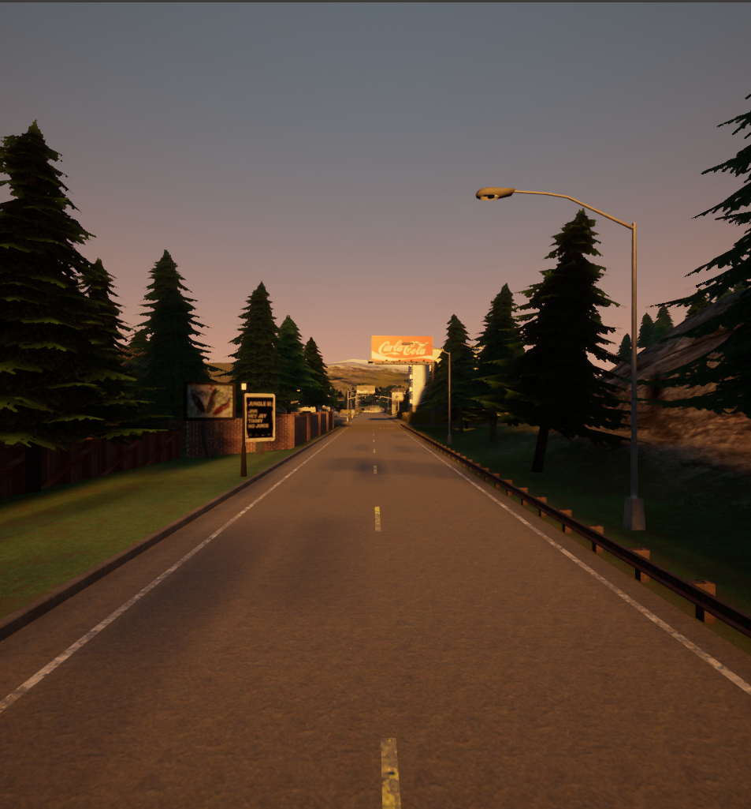
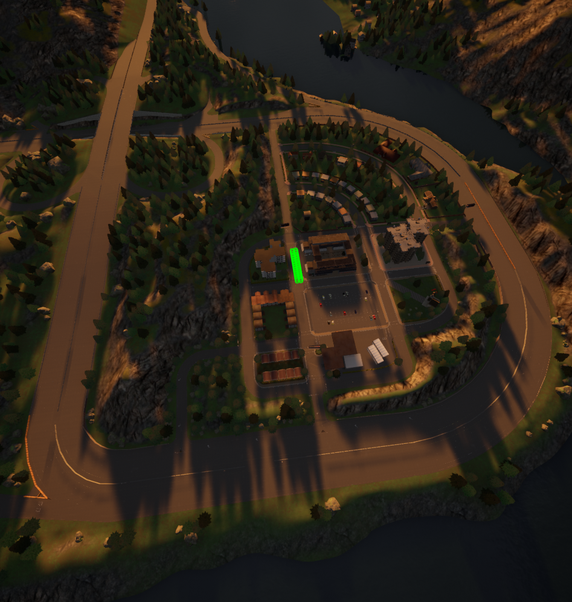

This is a short tutorial on using agents and traffic tools in CARLA. 
This wiki contains details about:
1. Spawning Vehicles in CARLA
2. Controlling these spawned Vehicles in CARLA.
3. Generating traffic behaviour using CARLA traffic manager.

## Pre-requisites
We assume that you have installed CARLA according to instructions on the website. 
This tutorial used CARLA 0.9.8.

Let's begin!
First, start the CARLA server:
```
./CarlaUE4.sh
```
This should open up the CARLA server and you will be greeted with a camera feed:



## Spawning a vehicle in CARLA
Now that we have the CARLA server running, we need to connect a client to it. 
Create a python file, and add the following lines to it:

```
import carla
client = carla.Client('localhost', 2000)
client.set_timeout(2.0)
```

We now have a client connected to CARLA!

Try exploring the city using the mouse and arrow keys. Try moving to a bird's eye view of the city and add the following lines to your code:
```
def draw_waypoints(waypoints, road_id=None, life_time=50.0):

  for waypoint in waypoints:

    if(waypoint.road_id == road_id):
      self.world.debug.draw_string(waypoint.transform.location, 'O', draw_shadow=False,
                                   color=carla.Color(r=0, g=255, b=0), life_time=life_time,
                                   persistent_lines=True)
                                   
waypoints = client.get_world().get_map().generate_waypoints(distance=1.0)
draw_waypoints(waypoints, road_id=10, life_time=20)
```
All roads in CARLA have an associated road_id. The code above will query the CARLA server for all the waypoints in the map, and the light up the waypoints that are present on road with road_id 10. You should see something like this:



This visualization helps us in finding out a good spawn location for a vehicle.
Let's spawn a 


Now, to spawn a vehicle in CARLA:
```

```

#### Bullet points and numbered lists
Here are some hints on writing (in no particular order):
- Focus on application knowledge.
  - Write tutorials to achieve a specific outcome.
  - Relay theory in an intuitive way (especially if you initially struggled).
    - It is likely that others are confused in the same way you were. They will benefit from your perspective.
  - You do not need to be an expert to produce useful content.
  - Document procedures as you learn them. You or others may refine them later.
- Use a professional tone.
  - Be non-partisan.
    - Characterize technology and practices in a way that assists the reader to make intelligent decisions.
    - When in doubt, use the SVOR (Strengths, Vulnerabilities, Opportunities, and Risks) framework.
  - Personal opinions have no place in the Wiki. Do not use "I." Only use "we" when referring to the contributors and editors of the Robotics Knowledgebase. You may "you" when giving instructions in tutorials.
- Use American English (for now).
  - We made add support for other languages in the future.
- The Robotics Knowledgebase is still evolving. We are using Jekyll and GitHub Pages in and a novel way and are always looking for contributors' input.

Entries in the Wiki should follow this format:
1. Excerpt introducing the entry's contents.
  - Be sure to specify if it is a tutorial or an article.
  - Remember that the first 100 words get used else where. A well written excerpt ensures that your entry gets read.
2. The content of your entry.
3. Summary.
4. See Also Links (relevant articles in the Wiki).
5. Further Reading (relevant articles on other sites).
6. References.

#### Code snippets
There's also a lot of support for displaying code. You can do it inline like `this`. You should also use the inline code syntax for `filenames` and `ROS_node_names`.

Larger chunks of code should use this format:
```
def recover_msg(msg):

        // Good coders comment their code for others.

        pw = ProtocolWrapper()

        // Explanation.

        if rec_crc != calc_crc:
            return None
```
This would be a good spot further explain you code snippet. Break it down for the user so they understand what is going on.

#### LaTex Math Support
Here is an example MathJax inline rendering \\( 1/x^{2} \\), and here is a block rendering:
\\[ \frac{1}{n^{2}} \\]

#### Images and Video
Images and embedded video are supported.






The video id can be found at the end of the URL. In this case, the URLs were
`https://www.youtube.com/watch?v=8P9geWwi9e0`
& `https://vimeo.com/148982525`.

## Summary
Use this space to reinforce key points and to suggest next steps for your readers.

## See Also:
- Links to relevant material within the Robotics Knowledgebase go here.

## Further Reading
- Links to articles of interest outside the Wiki (that are not references) go here.

## References
- Links to References go here.
- References should be in alphabetical order.
- References should follow IEEE format.
- If you are referencing experimental results, include it in your published report and link to it here.
